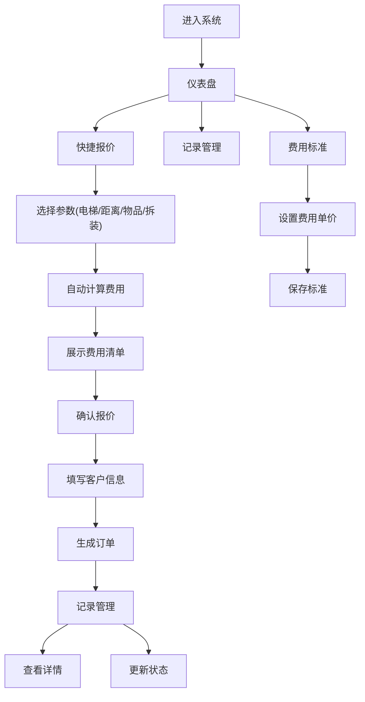

## 1. 产品概述

搬家管理系统是一款面向搬家公司和客户的业务管理工具，用于快速计算搬家费用、管理客户信息、记录搬家订单。系统通过标准化的费用计算模型，根据电梯情况、搬运距离、物品数量、是否拆装等因素自动生成报价，提升业务效率和客户体验。

## 2. 核心功能

### 2.1 用户角色
| 角色 | 登录方式 | 核心权限 |
|------|----------|----------|
| 管理员 | 本地登录 | 费用标准管理、订单全量管理、客户信息管理 |
| 操作员 | 本地登录 | 报价计算、订单登记、记录查询 |

### 2.2 功能模块
1. **首页/仪表盘**：快速统计、快捷入口
2. **报价计算**：根据各项参数自动计算搬家费用
3. **费用标准**：管理各项费用单价和规则
4. **客户登记**：录入和管理客户搬家信息
5. **记录管理**：查询、编辑、删除搬家记录

### 2.3 页面详情
| 页面名称 | 模块名称 | 功能描述 |
|----------|----------|----------|
| 仪表盘 | 数据概览 | 今日订单数、总收入、待处理订单统计 |
| 仪表盘 | 快捷入口 | 快速跳转到报价计算、新建订单 |
| 报价计算 | 参数选择 | 有无电梯、搬运距离、物品数量、拆装选项 |
| 报价计算 | 费用明细 | 展示各项费用明细和总价 |
| 报价计算 | 生成订单 | 将报价转为正式订单 |
| 费用标准 | 基础费用 | 起步价、楼层费、距离费单价设置 |
| 费用标准 | 附加费用 | 拆装费、大件物品费、夜间服务费设置 |
| 客户登记 | 基本信息 | 客户姓名、电话、地址录入 |
| 客户登记 | 搬家详情 | 起始地址、目的地址、搬家日期 |
| 记录管理 | 列表展示 | 所有订单列表，支持搜索筛选 |
| 记录管理 | 详情查看 | 查看订单完整信息和费用清单 |
| 记录管理 | 状态管理 | 修改订单状态（待确认/进行中/已完成） |

## 3. 核心流程

用户打开系统后，可通过报价计算页面选择各项参数（电梯情况、楼层、距离、物品数量、拆装需求），系统实时计算并展示费用明细。确认报价后可填写客户信息生成订单。所有订单在记录管理页面统一管理，支持查询、编辑和状态更新。管理员可在费用标准页面调整各项费用单价和规则。

## 4. 用户界面设计

### 4.1 设计风格
- **主色调**：深蓝色 (#1e40af)，体现专业可靠
- **辅助色**：橙色 (#f97316)，用于强调操作按钮
- **中性色**：灰白系列，保证内容可读性
- **按钮风格**：圆角设计，带悬停动效，主按钮渐变背景
- **字体**：中文使用思源黑体/系统黑体，数字使用等宽字体
- **布局风格**：左侧导航 + 右侧内容区，卡片式布局
- **图标风格**：线性图标，统一粗细，颜色与主题一致

### 4.2 页面设计概述
| 页面名称 | 模块名称 | UI元素 |
|----------|----------|--------|
| 仪表盘 | 数据概览 | 统计卡片、数字动画、趋势图标 |
| 仪表盘 | 快捷入口 | 图标按钮、悬停放大效果 |
| 报价计算 | 参数选择 | 开关切换、步进器、滑块、单选卡片 |
| 报价计算 | 费用明细 | 分栏列表、价格高亮、合计行加粗 |
| 费用标准 | 表单 | 输入框、数值调整器、保存按钮 |
| 记录管理 | 列表 | 表格、搜索框、筛选标签、状态徽标 |
| 记录管理 | 详情 | 模态框、信息分组、费用清单 |

### 4.3 响应式
- 桌面端优先设计，最小支持 1280px 宽度
- 平板端自适应调整，导航可折叠
- 移动端单列布局，触摸优化

### 4.4 交互动效
- 页面切换淡入过渡
- 数字变化滚动动画
- 按钮悬停缩放 + 阴影加深
- 表单输入聚焦高亮
- 费用计算实时更新，带过渡动效
