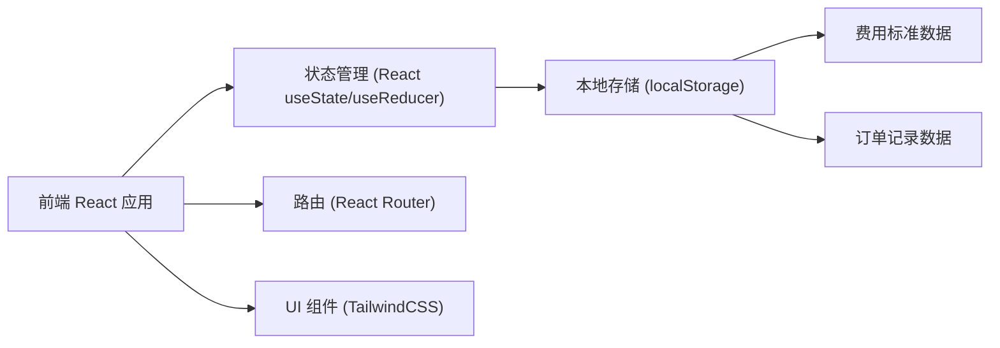
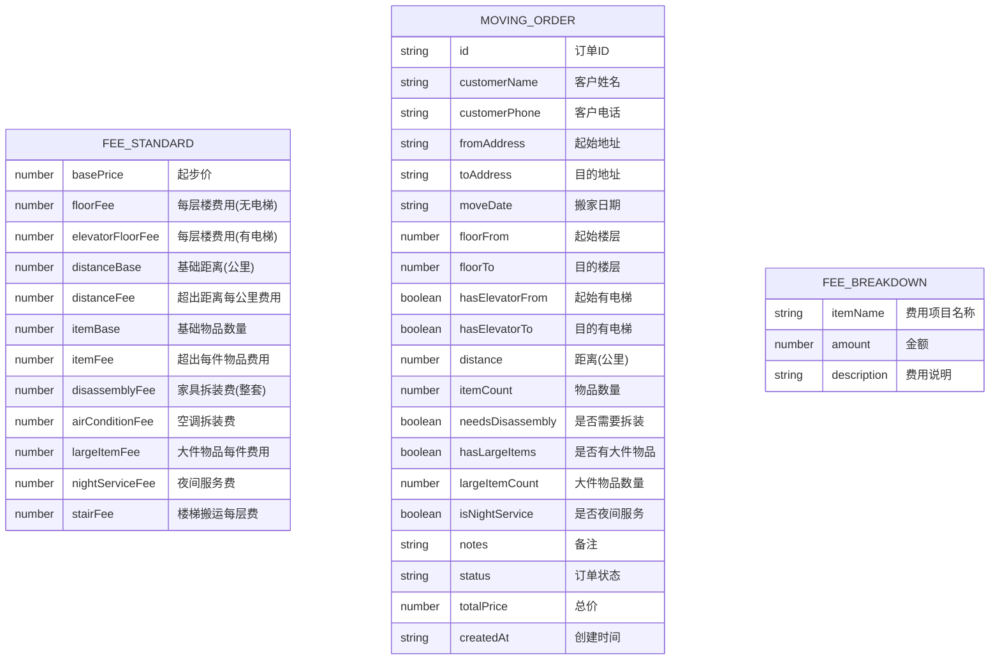

## 1. 架构设计



## 2. 技术描述

- **前端**: React@18 + TypeScript + Vite@5
- **样式方案**: TailwindCSS@3 + CSS 变量
- **路由**: React Router DOM@6
- **状态管理**: React Hooks (useState, useReducer, useContext)
- **数据持久化**: localStorage
- **图标**: Lucide React
- **初始化工具**: vite-init

**说明**: 本系统为纯前端应用，数据存储在浏览器 localStorage 中，无需后端服务。适合单用户或小型团队使用。

## 3. 路由定义

| 路由 | 页面名称 | 功能说明 |
|------|----------|----------|
| / | 仪表盘 | 数据概览、快捷入口 |
| /quote | 报价计算 | 参数选择、费用计算、费用清单 |
| /orders | 记录管理 | 订单列表、搜索筛选、详情查看 |
| /orders/new | 新建订单 | 客户信息登记、生成订单 |
| /standards | 费用标准 | 费用单价设置、规则管理 |

## 4. 数据模型

### 4.1 数据模型定义



### 4.2 费用计算规则

1. **起步价**: basePrice - 基础服务费用
2. **楼层费**: 
   - 有电梯: (floorFrom + floorTo) * elevatorFloorFee
   - 无电梯: (floorFrom + floorTo) * floorFee
3. **距离费**: 
   - 若 distance > distanceBase: (distance - distanceBase) * distanceFee
4. **物品费**: 
   - 若 itemCount > itemBase: (itemCount - itemBase) * itemFee
5. **拆装费**: needsDisassembly ? disassemblyFee : 0
6. **大件物品费**: hasLargeItems ? largeItemCount * largeItemFee : 0
7. **夜间服务费**: isNightService ? nightServiceFee : 0
8. **总价**: 以上所有费用之和

### 4.3 订单状态

- `pending`: 待确认
- `confirmed`: 已确认
- `in_progress`: 进行中
- `completed`: 已完成
- `cancelled`: 已取消

## 5. 项目目录结构

```
src/
├── components/          # 公共组件
│   ├── Layout/         # 布局组件
│   ├── Sidebar/        # 侧边栏
│   ├── Card/           # 卡片组件
│   ├── Button/         # 按钮组件
│   └── Modal/          # 模态框
├── pages/              # 页面组件
│   ├── Dashboard/      # 仪表盘
│   ├── Quote/          # 报价计算
│   ├── Orders/         # 记录管理
│   ├── OrderForm/      # 新建订单
│   └── Standards/      # 费用标准
├── store/              # 状态管理
│   ├── feeStandard.ts  # 费用标准状态
│   └── orders.ts       # 订单状态
├── utils/              # 工具函数
│   ├── calculator.ts   # 费用计算
│   └── storage.ts      # 本地存储
├── types/              # TypeScript 类型
│   └── index.ts
├── App.tsx
├── main.tsx
└── index.css
```
